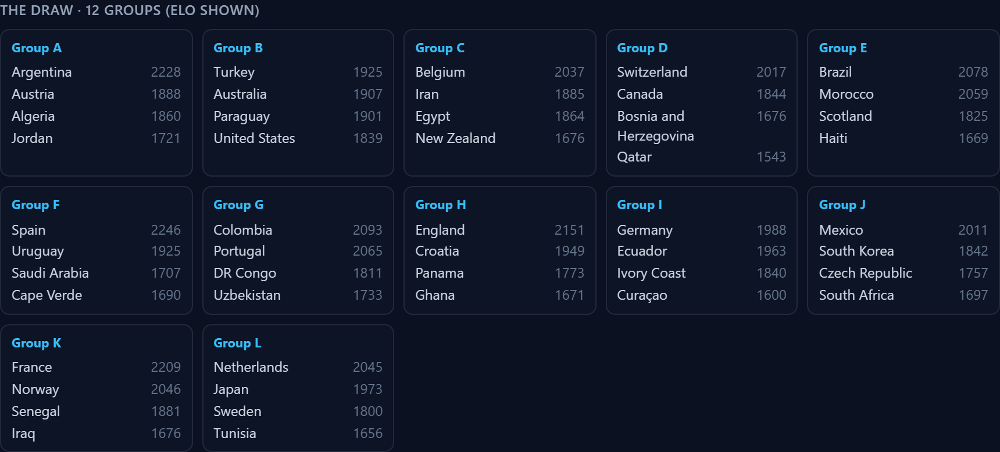
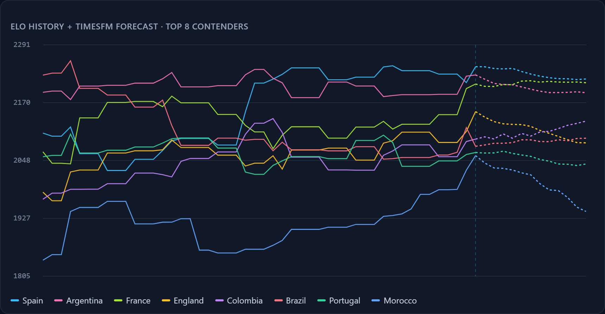
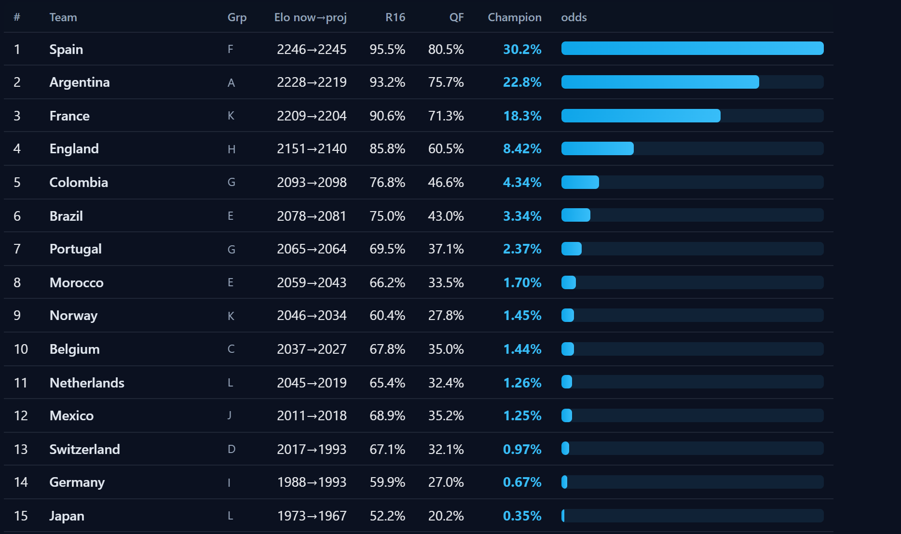

# Forecasting the 2026 World Cup in Your Browser — with a Time-Series Foundation Model

*How I reused a 70M-parameter TimesFM model to build a full 48-team World Cup
champion-odds simulator that runs entirely client-side — no server, no API, no
per-request cost.*

**Live demo:** https://vishalmysore.github.io/webForecast/wc/
**Code:** https://github.com/vishalmysore/webForecast (`docs/wc/`)


---

## TL;DR

I already had a real TimesFM time-series foundation model running in the browser
on WebGPU ([see the previous write-up](article.md)). This post is about pointing
it at a fun question: **who wins the 2026 World Cup?**

The honest answer is that a univariate forecaster like TimesFM can't answer
"who wins a tournament" directly — a champion is the output of a bracket of
pairwise matches, not the continuation of a curve. So I built a **two-stage
model**:

1. **TimesFM** projects each of the 48 teams' **Elo rating** forward from real
   match history.
2. A **Dixon-Coles** match model + a **Monte-Carlo of the actual 2026 format**
   (12 groups → best thirds → 32-team knockout) turns those strengths into a
   per-team **championship probability**.

Everything — the model, the 50,000-tournament simulation, the charts — runs in a
static page on your own GPU. Spain comes out top at ~30%, which is about where a
sensible bookmaker would put the favourite.

---

## Why TimesFM is the *wrong* tool — until you reframe the problem

TimesFM is a **univariate, patched decoder**. You feed it one numeric sequence
sampled at a regular interval and it extrapolates the next N points. It has no
concept of "opponent," "bracket," or "win." Feeding it "past World Cup winners"
would give you ~20 data points every four years of a signal that isn't even
autoregressive. That model would be a toy.

The trick is to use the forecaster for what it's genuinely good at — projecting a
**continuous team-strength signal** forward — and then bolt a proper tournament
model on top. Reframed that way, the pipeline looks like this:

```
match history ──▶ per-team Elo series ──▶ [TimesFM] ──▶ strength @ June 2026
(49k matches)      (monthly, regular)      forecaster    per team (48 teams)
                                                              │
                                                              ▼
                                              Dixon-Coles bivariate-Poisson
                                              (two Elos → a scoreline)
                                                              │
                                                              ▼
                                     Monte-Carlo the real 2026 format ×50k
                                                              │
                                                              ▼
                              champion odds + per-round survival probabilities
```

---

## Stage 0 — Real data, real Elo, the real draw

The foundation is [`martj42/international_results`](https://github.com/martj42/international_results):
**~49,000 international matches from 1872 to 2026**, including the scheduled 2026
World Cup fixtures. An offline script, `scripts/build_elo.py`, walks every match
chronologically and computes a **World Football Elo** rating:

```
R' = R + K · G · (W − We),   We = 1 / (10^(−dr/400) + 1)
```

where `dr` is the rating gap plus a home-field bonus, `G` is a goal-difference
multiplier (blowouts move ratings more), and `K` is a tournament weight (a World
Cup match counts for far more than a friendly). Each team's rating is then sampled
on a **monthly grid** — a regularly-spaced series, exactly the shape TimesFM
expects.

The same script reconstructs the **actual 12-group draw** for 2026 from the
scheduled fixtures (each team's first three opponents form its group), so the
tournament structure isn't invented — it's the real thing:



The output is a single 94 KB `elo.json` — 48 teams, their monthly Elo histories,
and the groups. That's all the browser needs.

---

## Stage 1 — TimesFM projects each team forward

This is where the foundation model earns its keep. For each of the 48 teams, the
page hands its monthly Elo series to the **same TimesFM 70M worker** the base app
uses — untouched — and reads back a probabilistic forecast: a median (q50)
trajectory plus a q10–q90 uncertainty band.

The **1-step-ahead q50** becomes the team's tournament-time strength; the
**q10/q90 spread** becomes its uncertainty. Here are the top 8 contenders — solid
lines are real Elo history, dashed lines are TimesFM's forward projection past the
boundary:



You can see the model doing something non-trivial: it doesn't just hold the last
value flat. Argentina's projection drifts down slightly, Colombia's ticks up —
each team's recent trajectory shapes where it lands going into the tournament.

All 48 forecasts run in about ten seconds on WebGPU and are **cached**, so
re-running the simulation with different settings is instant.

---

## Stage 2 — From two Elos to a scoreline (Dixon-Coles)

A tournament is decided by goals, not ratings, so we need a match model.
`poisson.js` maps a pair of Elo ratings to a **bivariate-Poisson scoreline
distribution** with the Dixon-Coles low-score correction:

```
λ_A = L0 · exp(+B · dr)        expected goals, team A
λ_B = L0 · exp(−B · dr)        expected goals, team B
P(x,y) = Pois(x;λ_A) · Pois(y;λ_B) · τ(x,y)
```

The constants are calibrated so an even match is ~1.3 goals a side (realistic for
internationals) and a 200-Elo edge yields roughly a +1.4-goal supremacy. For the
simulation we don't even need the full probability grid — we just **sample** a
scoreline per match, which gives us goal difference for group tiebreakers for free.

---

## Stage 3 — Monte-Carlo the real 2026 format

`tournament.js` plays the actual competition, 50,000 times:

- **Group stage.** 12 groups of 4, round-robin, 3/1/0 points. Rank on points, then
  goal difference, then goals scored.
- **Qualification.** The top two of every group (24) plus the **eight best
  third-placed teams** advance — exactly the 2026 rule — for a 32-team knockout.
- **Knockout.** Round of 32 → R16 → QF → SF → Final, with a penalty-shootout
  coin-flip (nudged by rating) on any draw.

Optionally — and this is the point of using a *forecaster* rather than a point
estimate — each team's strength is **redrawn from its TimesFM band on every
trial**, so the model's forecast uncertainty propagates all the way into the final
odds.

Fifty thousand full tournaments simulate in **a couple of seconds** in pure JS.

---

## The result



Spain leads at **30.2%**, followed by Argentina (**22.8%**) and France
(**18.3%**) — with the full survival chain visible: Spain reaches the Round of 16
95.5% of the time and the quarterfinals 80.5%. The probabilities span all 48 teams
and sum to 100%.

A few sanity checks that the machinery is sound:

- Exactly **32.0 teams qualify** and **16.0 reach the Round of 16** on average per
  trial — the structural invariants hold.
- Championship probabilities **sum to 1.000**.
- The favourites land in the **realistic ~15–30% range**. Even the strongest side
  in a 48-team field rarely clears a bookmaker's ~20–25%, and only looks higher
  here because this Elo snapshot has Spain a clear cut above the rest.

---

## Honest caveats

This is a **demonstration of a method**, not a betting model. Two things to keep in
mind:

- **The knockout seeding is a simplification.** FIFA fixes the Round-of-32 bracket
  by group position with a lookup table for where each group's third-placed team
  lands. I seed the 32 qualifiers on merit (group position, then points/GD, then
  Elo) into a standard bracket instead — faithful to spirit, not to the exact
  positional table.
- **The uncertainty is wide and real.** These are probabilities, not predictions.
  ~20 tournaments of history and a one-dimensional strength signal (Elo) can only
  say so much. The right way to read "Spain 30%" is "the most likely single winner,
  but far more likely *not* to win than to win."

---

## Run it yourself

The whole thing is static files. To reproduce the data pipeline:

```bash
# 1. fetch the results dataset (command is in .gitignore)
curl -L -o scripts/data/results.csv \
  https://raw.githubusercontent.com/martj42/international_results/master/results.csv

# 2. build Elo + the group draw -> docs/wc/elo.json
python scripts/build_elo.py

# 3. serve and open /wc/
npx serve docs -p 5187      # http://localhost:5187/wc/
```

Click **Forecast tournament** and watch 48 TimesFM forecasts feed 50,000 simulated
World Cups — entirely on your own GPU.

---

## Why this pattern matters

The interesting takeaway isn't the soccer odds — it's the **shape of the
solution**. A foundation model rarely answers your real question directly. But used
as *one stage* — the part that projects a noisy signal forward — inside a
domain-specific model you already trust, it becomes genuinely useful. Here TimesFM
does one narrow job (turn each team's Elo trajectory into a tournament-time
strength with honest error bars), and classical sports-modelling (Poisson +
Monte-Carlo) does the rest.

And because the whole stack — a 70M-parameter transformer plus a 50,000-run
simulation — fits in a static web page, it costs nothing to serve and the data
never leaves the device.

---

## Credit & license

The time-series model is the work of
**[Fareed Khan](https://github.com/FareedKhan-dev)**
([timesfm-from-scratch](https://github.com/FareedKhan-dev/timesfm-from-scratch)).
Match data is from
**[martj42/international_results](https://github.com/martj42/international_results)**.
Everything here is MIT-licensed. Free to use, modify, and publish with attribution.
